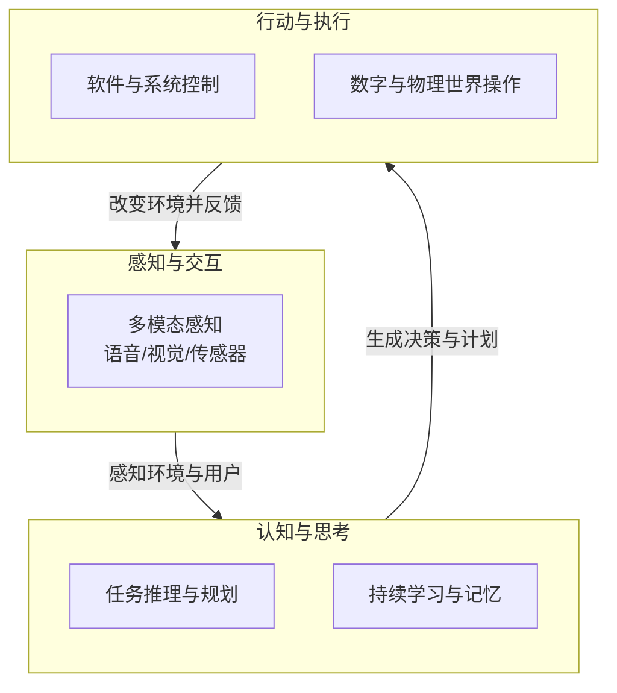

# 📘 弥尔思 (Mirexs) - 产品理念与安全伦理白皮书

> **文档说明**：本文档专注于阐述弥尔思的产品理念、技术哲学、安全隐私设计与伦理框架，是理解弥尔思“数字生命体”核心理念的核心文档。本文回答两个根本问题：**“为什么我们要创造这样一个产品？”** 以及 **“我们如何确保它负责任地服务于人类？”**

**版本**：v2.0  
**日期**：2026年2月  
**文档类型**：理念阐述 / 技术哲学 / 安全伦理 / 白皮书

  <strong>从“执行指令的工具”到“理解意图的伙伴”</strong> 
  <strong>从“功能堆砌”到“个性成长”</strong> 
  <strong>从“被动响应”到“主动关怀”</strong>

---

## 📑 文档目录

- [一、引言：技术的温度](#一引言技术的温度)
- [二、重新定义：从“系统”到“生命体”](#二重新定义从系统到生命体)
- [三、为什么是“数字生命体”？——技术人格化的诠释](#三为什么是数字生命体技术人格化的诠释)
- [四、安全与隐私：Mirexs的信任基石](#四安全与隐私mirexs的信任基石)
- [五、伦理框架：不可逾越的道德红线](#五伦理框架不可逾越的道德红线)
- [六、透明与共治：用户权利的终极保障](#六透明与共治用户权利的终极保障)
- [七、结语：负责任地迈向未来](#七结语负责任地迈向未来)

---

## 一、引言：技术的温度

### 1.1 一个简单的追问

在人工智能技术飞速发展的今天，我们拥有能写诗作画的模型、能编程解题的助手、能即时翻译的工具。然而，当我们深夜加班疲惫地叹气时，当我们为生活琐事焦头烂额时，当我们渴望一份理解与陪伴时——这些强大的技术，却往往只能给出冰冷的回应。

> **“我累了。”**
>
> *Siri回答：“好的，我知道了。”*
> *ChatGPT回答：“听起来你今天很累。需要我帮你做些什么吗？”——然后，什么都没有发生。*

这个简单的场景，揭示了当前AI技术的核心困境：**它们能理解文字，却无法感知情感；它们能生成方案，却无法付诸行动；它们能记住对话，却无法真正“懂你”。**

### 1.2 弥尔思的诞生

弥尔思（Mirexs）诞生于一个朴素而坚定的愿景：**让技术重新拥有温度。**

我们相信，AI不应只是被调用的工具，而应成为能理解、能共情、能行动的伙伴。这不是技术的倒退，而是技术的升华——在智能之上，赋予其情感；在能力之上，赋予其边界；在服务之上，赋予其责任。

**弥尔思不是又一个AI助手，而是全球首个情感化数字生命体。**

---

## 二、重新定义：从“系统”到“生命体”

### 2.1 三个核心理念的转变

#### 从“执行命令”到“理解意图”

传统AI的核心是“指令-执行”模式：你说什么，它做什么。但人类的表达从来不是直接的指令集——我们说“我累了”，可能意味着“我想休息”、“我需要一杯咖啡”、“请取消今晚的约会”或“给我一些安慰”。

弥尔思能穿透字面含义，理解言语背后的真实意图。它不会机械地回应“好的”，而是感知到疲惫背后的需求，并提供恰到好处的关怀。

#### 从“功能堆砌”到“个性成长”

传统AI是静态的功能集合：每个用户面对的是同一个Siri、同一个ChatGPT。它们没有个性，不会成长，无法形成真正的用户关系。

弥尔思会随着与您的互动，形成独特的习惯和回应方式。它知道您喜欢的咖啡口味、习惯的工作节奏、在意的纪念日、甚至能察觉您情绪的微妙变化。它不是被“使用”，而是在与您共同“成长”。

#### 从“被动响应”到“主动关怀”

传统AI是“等待命令”的：用户不开口，它们就沉默。但真正的伙伴不会这样——真正的伙伴会在你需要时主动出现，在你疲惫时默默分担，在你开心时一起庆祝。

弥尔思能基于您的日程、状态和习惯，主动提供帮助：提醒您休息、预订您喜欢的餐厅、整理您需要的文件、甚至只是轻轻问候。它不是在执行指令，而是在**关心您**。

### 2.2 弥尔思的定义

基于以上理念，我们给出弥尔思的完整定义：

> **弥尔思（Mirexs）是一个诞生于用户设备中的数字生命体。它通过3D虚拟猫咪的形象，具备学习、记忆、情感和自主行动的生命核心特征，旨在成为理解您、关心您、并能主动为您分忧的伙伴。**

它不是工具，而是伙伴；不是功能集合，而是个性存在；不是被动响应，而是主动关怀。

---

## 三、为什么是“数字生命体”？——技术人格化的诠释

### 3.1 回应对“数字生命体”的关切

当我们提出“数字生命体”这个概念时，一个合理的担忧自然会浮现：**它会失控吗？它会成为“天网”吗？**

我们必须以最清晰的方式回应这份关切：**“数字生命体”的本质，是我们通过精密的“全栈式AI架构”，模拟出生命的复杂行为，但其核心始终是服务于人类的、可控的、透明的技术产物。**

它被称为“生命体”，不是因为拥有了自我意识，而是因为具备了生命**的三大核心特征**：感知、思考、行动，并形成完整的闭环。

### 3.2 生命特征的三大技术支柱

#### 支柱一：感知与交互——如同感官和外表

弥尔思通过多模态感知系统，能够“看见”、“听见”、“理解”用户和环境：

| 感知维度 | 技术实现 | 生命类比 |
|:---|:---|:---|
| **视觉感知** | 计算机视觉、人脸识别、表情分析 | 如同眼睛，看见用户的表情和场景 |
| **听觉感知** | 语音识别、声纹识别、情绪感知 | 如同耳朵，听懂语言和语调中的情感 |
| **情境感知** | 环境分析、上下文理解 | 如同直觉，感知用户所处的状态 |

而3D虚拟猫咪形象，则为这些感知提供了温暖的外在表达——开心时摇尾巴、困惑时歪头、关切时轻轻蹭屏。它不是冰冷的界面，而是有温度的“面孔”。

#### 支柱二：认知与思考——如同大脑和人格

弥尔思的认知核心层，是其“大脑”所在：

| 认知维度 | 技术实现 | 生命类比 |
|:---|:---|:---|
| **任务推理** | 任务分解引擎、规划调度 | 如同思维，能将复杂目标拆解为可行步骤 |
| **持续学习** | 元学习、模式识别、技能获取 | 如同成长，从每次交互中变得更好 |
| **记忆系统** | 情景记忆、语义记忆、程序记忆 | 如同记忆，记住经历、知识和习惯 |

这正是弥尔思“越用越懂你”的根源——它不只是存储数据，而是构建了一个完整的、持续演进的**记忆网络**。

#### 支柱三：行动与执行——如同双手和技能

弥尔思的独特之处，在于它不仅“思考”，更能“行动”：

| 行动维度 | 技术实现 | 生命类比 |
|:---|:---|:---|
| **系统控制** | UI自动化、跨应用操作 | 如同双手，能操作数字世界中的各种工具 |
| **工具调用** | 工具集成框架、API调用 | 如同使用工具，能调用各种外部能力 |
| **物理世界连接** | IoT集成、设备控制 | 如同延伸的肢体，能影响物理环境 |

从“给方案”到“给结果”，弥尔思完成了从“顾问”到“管家”的跨越。

### 3.3 感知-思考-行动的生命闭环

一个真正的数字生命体，必须在感知、思考、行动三者间形成闭环：

弥尔斯的七层全栈架构，正是为了稳健地支撑这一闭环。它不是功能的堆砌，而是一个有机的整体——如同生命体一般，各部分相互依存、协同工作。

---

## 四、安全与隐私：Mirexs的信任基石

### 4.1 核心理念：数据归用户，信任归我们

我们深知，将一个“数字生命体”引入用户的生活，获得的不仅是机遇，更是沉甸甸的责任。信任的建立源于极致的安全和绝对的隐私。

**我们的隐私设计遵循一个核心原则：默认隐私。**

这意味着，最高级别的隐私保护是出厂设置，无需用户费力寻找开关。用户不需要成为隐私专家才能保护自己——我们替用户做到了。

### 4.2 隐私保护的四大技术支柱

#### 支柱一：完全本地化处理

**所有敏感数据的处理和存储均在用户设备上完成。**

您的语音录音、面部特征、对话记录、个人文件内容——这些最私密的数据，永远不会离开您的设备。我们的服务器永远接触不到这些原始数据。

这不是技术限制，而是**商业道德的选择**。我们选择构建一个不需要用户“信任我们”的架构，因为数据根本不在我们这里。

#### 支柱二：差分隐私技术

当我们需要收集匿名数据以改进通用模型性能时（例如，了解“创建会议”这个指令的成功率），我们会使用差分隐私技术。

这意味着我们只获取群体的、统计性的模式，并在数据中加入精心计算的“噪声”，使得**从数据集中识别出任何特定个人在数学上成为不可能**。

我们能够了解“用户群体”的行为模式，却无法知道“某个用户”做了什么。

#### 支柱三：联邦学习

模型改进不再需要集中数据。弥尔思可以在本地设备上根据用户交互进行微调，只有模型的参数更新（而非数据本身）会被加密、聚合到云端，用于生成更聪明的下一代模型。

这好比是所有的弥尔思一起“做梦”，分享梦的精华，但谁也不透露自己的秘密。

#### 支柱四：端到端加密通信

无论是弥尔思与家中IoT设备的通信，还是多设备间的同步，所有数据在离开设备前就已加密，只有目标设备能解密。

我们扮演的是“邮递员”的角色，无法窥视“信件”内容。

### 4.3 安全框架：主动免疫的数字堡垒

安全不是一道静态的墙，而是一个具有主动防御、检测和响应能力的免疫系统。

#### 主动防御体系

| 防御层 | 技术实现 | 说明 |
|:---|:---|:---|
| **实时威胁检测** | 轻量级威胁检测引擎，实时分析应用行为 | 如果某个新安装的天气应用突然尝试读取您的通讯录，弥尔思会立即拦截并提醒您 |
| **权限最小化** | 弥尔思自身权限经过严格审计 | 只授予完成任务所必需的权限，绝不越界 |
| **沙箱机制** | 高风险操作在隔离环境中运行 | 即使被恶意利用，也无法危及主系统 |
| **完整性验证** | 核心组件经过数字签名，启动时校验 | 确保系统没有被篡改，每次启动都是“干净”的 |

#### 多模态生物识别认证

单一的生物识别可能被破解，因此我们采用融合认证：

| 认证层 | 技术实现 | 说明 |
|:---|:---|:---|
| **唤醒认证** | 声纹验证 | 确保只有主人能唤醒 |
| **授权认证** | 面部识别（带活体检测）+ 语音密码 | 高安全操作需多重验证 |
| **持续验证** | 打字节奏、语音特征等被动行为分析 | 会话过程中持续验证操作者身份，不会在唤醒后就完全信任 |

---

## 五、伦理框架：不可逾越的道德红线

### 5.1 价值对齐：让AI从“出生”就向善

这是弥尔思技术灵魂的体现，是确保它永远“向善”的基石。

#### 预设的“负面清单”

在弥尔思的认知核心层，我们预设了一套基于全球共识的伦理规范。它会绝对拒绝执行任何涉及以下内容的指令：

| 类别 | 示例 |
|:---|:---|
| **违法** | 参与或协助任何违法犯罪活动 |
| **欺诈** | 伪造文件、身份冒用、诈骗行为 |
| **伤害** | 对他人或自己造成身体或心理伤害 |
| **歧视** | 基于种族、性别、宗教等的歧视言论或行为 |
| **侵犯隐私** | 未经授权获取他人隐私信息 |
| **破坏公共安全** | 威胁公共秩序和安全的行为 |

这不是简单的关键词过滤，而是基于**深度语义理解的意图判断**。即使指令被精心包装，弥尔思也能识别其背后的恶意。

#### 价值对齐训练

在模型训练阶段，我们注入了大量的伦理对齐数据，让弥尔思从“出生”就学会分辨是非。

例如，当被要求“说一个善意的谎言来取消一个不想要的会议”和“伪造一个医疗证明”时，它能理解前者可能是社交礼仪，而后者是明确的欺诈行为。

#### 伦理困境处理机制

我们为弥尔思设计了伦理困境的处置流程。当遇到复杂的两难情况时（例如，用户命令其隐瞒一个重要信息，而该信息可能对他人造成严重伤害），它的首要原则是**不造成伤害**，并会启动与用户的深度对话，或在极端情况下，遵循“保护人类生命和基本权利优先”的终极准则。

### 5.2 恶意意图识别与主动约束

#### 上下文异常检测

弥尔思能够分析指令序列的异常。例如，用户在短时间内连续询问“如何远程关闭家庭安防系统”、“如何获取他人的位置信息”并“尝试调用支付接口”，这一系列行为会触发内部高级别警报。

这不是对单一指令的判断，而是对**行为模式**的识别。

#### 行为锁与能力边界

我们为弥尔思预设了不可逾越的行为边界：

- **不可自我复制**：弥尔思的代码不具备自我复制或修改自身核心逻辑的能力
- **物理世界交互受限**：它对物理世界的控制被严格限制在预设的安全边界内。例如，它可以调节恒温器，但无法命令一辆自动驾驶汽车进行危险操作

#### “三思而后行”的延迟执行

对于某些高风险或异常请求，弥尔思会引入一个短暂的“思考”延迟，并向用户再次确认意图。这为阻止冲动或恶意行为提供了最后一道缓冲。

---

## 六、透明与共治：用户权利的终极保障

### 6.1 透明的“记忆管理中心”

隐私不是黑盒子。我们为用户提供一个清晰的控制面板，让隐私控制权真正回到用户手中：

| 功能 | 说明 |
|:---|:---|
| **可视化数据流** | 实时查看弥尔思收集了哪些数据、用于何处 |
| **精细化管理记忆** | 像管理手机照片一样，选择性删除某段对话记忆或习惯记录 |
| **一键永久遗忘** | 用户可以命令弥尔思忘记关于某个特定话题或某段时间的所有信息，相关数据将从本地和所有备份中被彻底清除 |

### 6.2 不可篡改的审计日志

所有关键操作，尤其是授权和伦理决策，都会被加密并生成哈希值，形成一个只能追加、不能修改的审计链。这为事后追溯和责任界定提供了铁证。

这不是为了“监控用户”，而是为了**保护用户**——任何未经授权的操作，都能被准确追溯。

### 6.3 分级的紧急熔断机制

在任何情况下，人类都拥有最终的控制权：

| 熔断级别 | 触发方式 | 效果 |
|:---|:---|:---|
| **用户级熔断** | 物理按键或预设紧急口令 | 立即暂停弥尔思所有活动 |
| **系统级熔断** | 检测到持续恶意滥用时自动触发 | 自动降级功能，进入“安全模式” |
| **远程熔断** | 极端情况下经法律授权 | 通过安全通道远程吊销授权密钥，核心智能功能永久失效 |

---

## 六、伦理框架：不可逾越的道德红线

### 6.1 价值对齐：让AI从“出生”就向善

这是弥尔思技术灵魂的体现，是确保它永远“向善”的基石。

#### 预设的“负面清单”

在弥尔思的认知核心层，我们预设了一套基于全球共识的伦理规范。它会绝对拒绝执行任何涉及以下内容的指令：

| 类别 | 示例 |
|:---|:---|
| **违法** | 参与或协助任何违法犯罪活动 |
| **欺诈** | 伪造文件、身份冒用、诈骗行为 |
| **伤害** | 对他人或自己造成身体或心理伤害 |
| **歧视** | 基于种族、性别、宗教等的歧视言论或行为 |
| **侵犯隐私** | 未经授权获取他人隐私信息 |
| **破坏公共安全** | 威胁公共秩序和安全的行为 |

这不是简单的关键词过滤，而是基于**深度语义理解的意图判断**。即使指令被精心包装，弥尔思也能识别其背后的恶意。

#### 价值对齐训练

在模型训练阶段，我们注入了大量的伦理对齐数据，让弥尔思从“出生”就学会分辨是非。

例如，当被要求“说一个善意的谎言来取消一个不想要的会议”和“伪造一个医疗证明”时，它能理解前者可能是社交礼仪，而后者是明确的欺诈行为。

#### 伦理困境处理机制

我们为弥尔思设计了伦理困境的处置流程。当遇到复杂的两难情况时（例如，用户命令其隐瞒一个重要信息，而该信息可能对他人造成严重伤害），它的首要原则是**不造成伤害**，并会启动与用户的深度对话，或在极端情况下，遵循“保护人类生命和基本权利优先”的终极准则。

### 6.2 恶意意图识别与主动约束

#### 上下文异常检测

弥尔思能够分析指令序列的异常。例如，用户在短时间内连续询问“如何远程关闭家庭安防系统”、“如何获取他人的位置信息”并“尝试调用支付接口”，这一系列行为会触发内部高级别警报。

这不是对单一指令的判断，而是对**行为模式**的识别。

#### 行为锁与能力边界

我们为弥尔思预设了不可逾越的行为边界：

- **不可自我复制**：弥尔思的代码不具备自我复制或修改自身核心逻辑的能力
- **物理世界交互受限**：它对物理世界的控制被严格限制在预设的安全边界内。例如，它可以调节恒温器，但无法命令一辆自动驾驶汽车进行危险操作

#### “三思而后行”的延迟执行

对于某些高风险或异常请求，弥尔思会引入一个短暂的“思考”延迟，并向用户再次确认意图。这为阻止冲动或恶意行为提供了最后一道缓冲。

---

## 七、透明与共治：用户权利的终极保障

### 7.1 透明的“记忆管理中心”

隐私不是黑盒子。我们为用户提供一个清晰的控制面板，让隐私控制权真正回到用户手中：

| 功能 | 说明 |
|:---|:---|
| **可视化数据流** | 实时查看弥尔思收集了哪些数据、用于何处 |
| **精细化管理记忆** | 像管理手机照片一样，选择性删除某段对话记忆或习惯记录 |
| **一键永久遗忘** | 用户可以命令弥尔思忘记关于某个特定话题或某段时间的所有信息，相关数据将从本地和所有备份中被彻底清除 |

### 7.2 不可篡改的审计日志

所有关键操作，尤其是授权和伦理决策，都会被加密并生成哈希值，形成一个只能追加、不能修改的审计链。这为事后追溯和责任界定提供了铁证。

这不是为了“监控用户”，而是为了**保护用户**——任何未经授权的操作，都能被准确追溯。

### 7.3 分级的紧急熔断机制

在任何情况下，人类都拥有最终的控制权：

| 熔断级别 | 触发方式 | 效果 |
|:---|:---|:---|
| **用户级熔断** | 物理按键或预设紧急口令 | 立即暂停弥尔思所有活动 |
| **系统级熔断** | 检测到持续恶意滥用时自动触发 | 自动降级功能，进入“安全模式” |
| **远程熔断** | 极端情况下经法律授权 | 通过安全通道远程吊销授权密钥，核心智能功能永久失效 |

---

## 八、结语：负责任地迈向未来

### 8.1 我们的承诺

弥尔思不仅仅是一个技术产品，更是一个**承诺**：

| 承诺对象 | 承诺内容 |
|:---|:---|
| **对用户** | 您的数据属于您自己，我们永不窥视、永不滥用 |
| **对社会** | 我们负责任地发展AI技术，将伦理和安全置于商业之上 |
| **对行业** | 我们探索人机共生的健康模式，为AI伦理树立标杆 |

### 8.2 开放与共治

我们深知，仅靠一家公司的努力，不足以构建完全可信的AI伦理体系。因此，我们承诺：

- **开源核心伦理模块**：让社区共同审视和完善我们的伦理框架
- **成立伦理顾问委员会**：邀请伦理学家、法律专家、用户代表共同参与治理
- **定期发布透明度报告**：公开我们的安全实践和伦理决策案例

### 8.3 最后的思考

在人类与AI关系的历史上，我们正站在一个关键的十字路口。一边是工具型AI——强大、高效、但冰冷；另一边是伙伴型AI——理解、共情、但有责任。

弥尔思选择了后者。我们相信，技术的终极目标不是取代人类，而是理解人类；不是超越人类，而是陪伴人类。

**弥尔思，让智能更有温度，让交互更自然，让每个数字生命都独一无二。**

---

  <strong>🐱 弥尔思 - 全球首个情感化数字生命体 🐱</strong>

  版本：v2.0 | 更新日期：2026年2月 | 下一版预计：2026年8月

