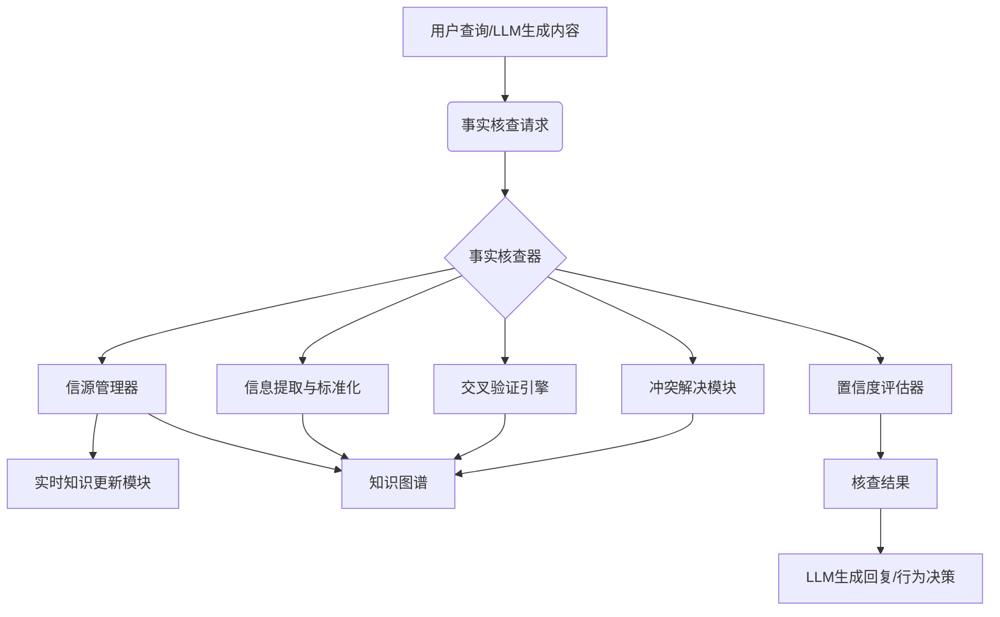

# 事实核查器技术设计

## 1. 引言

Mirexs 作为一个智能数字生命体，其输出内容的准确性和可靠性至关重要。事实核查器（Fact Checker）旨在确保 Mirexs 在回答用户问题、提供信息或执行任务时，所依据的事实和数据是准确、一致且可信的。本文档详细阐述 Mirexs 事实核查器的技术设计，包括其设计理念、整体架构、核心组件职责、信源评估机制、交叉验证逻辑、冲突解决策略以及与其他模块的交互流程。

## 2. 设计理念

Mirexs 事实核查器的核心理念是构建一个**多维度、多阶段、自适应**的验证系统，模拟人类在获取信息时进行批判性思考和交叉验证的过程。它不仅仅是简单的关键词匹配，而是深入到语义层面，评估信息的来源、时效性和一致性。

*   **多源验证**：不依赖单一信息源，而是综合多个独立信源进行比对。
*   **置信度评估**：对每条信息及其来源赋予置信度，指导后续决策。
*   **实时性与时效性**：优先考虑最新、最权威的信息，并对过时信息进行标记或淘汰。
*   **可解释性**：能够追溯核查过程，解释信息被认定为真或假的原因。
*   **持续学习**：通过用户反馈和人工校正，不断优化核查策略和信源权重。

## 3. 整体架构与集成

事实核查器作为 Mirexs 认知核心层（Cognitive Layer）的重要组成部分，与知识图谱、实时知识更新、多模型路由等模块紧密集成。

## 4. 核心组件职责

### 4.1 信源管理器 (Source Manager)

*   **职责**：管理和维护一个可信赖的信息源列表，包括新闻机构、学术数据库、官方报告、权威百科等。
*   **功能**：
    *   **信源注册与分类**：对信源进行分类（如新闻、学术、政府、社交媒体），并记录其元数据（如 URL、API 接口、可信度评分、更新频率）。
    *   **信源权重分配**：根据信源的历史准确性、权威性、时效性等因素，动态调整其权重。例如，官方统计数据权重高于个人博客。
    *   **信源健康监控**：定期检查信源的可用性和响应速度。

### 4.2 信息提取与标准化 (Information Extraction & Standardization)

*   **职责**：从各种信源中提取关键事实，并将其标准化为统一的结构化格式（如三元组：主语-谓语-宾语）。
*   **功能**：
    *   **自然语言处理 (NLP)**：利用命名实体识别（NER）、关系抽取（RE）等技术从文本中提取实体和关系。
    *   **数据解析**：针对不同信源的数据格式（如 HTML、JSON、XML），使用相应的解析器提取信息。
    *   **事实结构化**：将提取到的信息转换为统一的事实表示，便于后续比对和存储。

### 4.3 交叉验证引擎 (Cross-Validation Engine)

*   **职责**：比对从多个信源提取到的事实，评估其一致性。
*   **功能**：
    *   **事实比对**：对标准化后的事实进行语义比对，判断它们是否表达了相同或相似的含义。
    *   **冲突检测**：识别相互矛盾的事实。例如，两个信源对同一事件的发生时间给出不同描述。
    *   **支持度计算**：统计支持某个事实的信源数量及其权重，计算该事实的“支持度”。

### 4.4 冲突解决模块 (Conflict Resolution Module)

*   **职责**：在检测到事实冲突时，根据预设策略进行仲裁，得出最可信的结论。
*   **功能**：
    *   **权重仲裁**：优先采纳来自高权重信源的事实。例如，如果官方报告与新闻报道冲突，以官方报告为准。
    *   **多数原则**：如果多个信源支持同一事实，而少数信源提出异议，则采纳多数意见。
    *   **时效性判断**：对于时间敏感的事实，采纳最新更新的信息。
    *   **用户介入**：对于无法自动解决的重大冲突，可提示用户进行人工判断。

### 4.5 置信度评估器 (Confidence Evaluator)

*   **职责**：综合信源权重、支持度、时效性、冲突解决结果等因素，为核查结果生成一个最终的置信度评分。
*   **功能**：
    *   **综合评分**：采用加权平均或其他机器学习模型，将各项指标整合为 0-1 之间的置信度分数。
    *   **阈值判断**：根据置信度分数，将事实标记为“已验证”、“待核查”、“存疑”或“不实”。

## 5. 与其他模块的交互流程

### 5.1 与实时知识更新模块 (`real_time_knowledge.py`)

*   **信息摄取**：实时知识更新模块负责从互联网（如 RSS Feeds、新闻网站）抓取最新信息。这些信息在进入 Mirexs 知识库之前，会首先通过事实核查器进行初步验证。
*   **信源更新**：事实核查器可以根据核查结果，向实时知识更新模块提供新的可信信源或标记不可信信源。

### 5.2 与知识图谱 (`knowledge_graph.md`)

*   **事实存储**：经过事实核查器验证为“已验证”的事实，将被结构化后存储到知识图谱中，作为 Mirexs 的可靠知识基础。
*   **冲突检测**：当新的事实与知识图谱中已有的事实发生冲突时，事实核查器会被触发，进行冲突解决。
*   **推理验证**：知识图谱中的逻辑约束和关系可以用于辅助事实核查器进行推理验证，例如，如果知识图谱显示“A是B的父亲”，而某个信息声称“A是B的儿子”，则事实核查器会标记为冲突。

### 5.3 与多模型路由 (`multi_model_routing.md`)

*   **风险评估**：事实核查器可以为 LLM 生成的内容提供事实准确性风险评估。对于高风险内容，多模型路由可能会选择更保守的模型，或者在生成前强制进行事实核查。
*   **生成约束**：在 LLM 生成回复时，事实核查器可以作为后处理步骤，检查生成内容的事实准确性，并在必要时进行修正或要求 LLM 重新生成。

### 5.4 与对话生成模块

*   **回复修正**：如果 Mirexs 生成的回复中包含不准确的事实，事实核查器会标记并建议修正，确保提供给用户的都是准确信息。
*   **置信度提示**：在某些情况下，如果事实核查器对某个信息的置信度不高，Mirexs 可以在回复中向用户提示“此信息可能存在争议”或“我仍在核实此信息”。

## 6. 性能指标与优化

*   **准确率 (Accuracy)**：事实核查器正确判断事实真伪的比例。
*   **召回率 (Recall)**：所有不实信息中，被事实核查器成功识别的比例。
*   **延迟 (Latency)**：从接收核查请求到输出核查结果的时间。目标是 P95 < 500ms。
*   **信源覆盖率**：事实核查器能够访问和利用的信源数量和多样性。

## 7. 参考文献

*   [1] Thorne, J., Vlachos, A., Christodoulopoulos, P., & Mittal, A. (2018). FEVER: A Large-scale Dataset for Fact Extraction and VERification. *Proceedings of the 2018 Conference of the North American Chapter of the Association for Computational Linguistics: Human Language Technologies, Volume 1 (Long and Short Papers)*.
*   [2] Guo, L., & Li, Y. (2020). A Survey on Fact Checking. *ACM Computing Surveys (CSUR), 53*(1), 1-37.
*   [3] Li, Z., et al. (2026). *Mirexs项目设计.md*. Internal Document.

**作者签名**：Zikang Li
**日期**：2026-03-18
