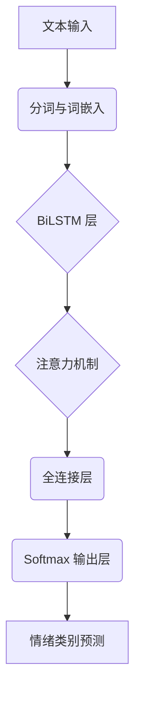

# 神经网络详细设计

## 1. 引言

本文档深入阐述 Mirexs 项目中各类神经网络（Neural Networks）的具体设计与实现细节，特别是情绪识别神经网络（Emotion Neural Network）。我们将详细探讨其网络结构、输入特征工程、训练数据集构建、损失函数、优化器选择以及模型评估与部署策略。神经网络是 Mirexs 认知核心层（Cognitive Layer）和交互呈现层（Interaction Layer）的关键技术支撑，赋予 Mirexs 情感感知、多模态理解和智能决策的能力。

## 2. 情绪识别神经网络（Emotion Neural Network）

Mirexs 的情绪识别神经网络（`emotion_nn.py`）旨在从文本、语音、视觉等多模态输入中准确识别用户的情绪状态，从而驱动 Mirexs 的情感化交互和行为决策。当前版本主要聚焦于文本情绪识别，并预留多模态扩展接口。

### 2.1 情绪分类体系

Mirexs 采用一套包含六种基本情绪的分类体系，以实现对用户情绪的精细化感知：

| 情绪类别 | 描述 | 示例关键词 |
|:---|:---|:---|
| **喜悦 (Joy)** | 积极、开心、满足 | 开心、高兴、兴奋、愉快 |
| **悲伤 (Sadness)** | 消极、失落、沮丧 | 难过、伤心、沮丧、失落 |
| **愤怒 (Anger)** | 负面、不满、敌意 | 生气、愤怒、恼火、不满 |
| **惊讶 (Surprise)** | 意外、出乎意料 | 惊讶、意外、震惊、诧异 |
| **恐惧 (Fear)** | 担忧、不安、害怕 | 害怕、恐惧、担忧、紧张 |
| **厌恶 (Disgust)** | 反感、不适、排斥 | 恶心、反感、厌恶、不适 |

### 2.2 网络结构设计

考虑到实时性、准确性和可部署性，Mirexs 的情绪识别神经网络采用 **Bi-directional LSTM (BiLSTM) 结合注意力机制 (Attention Mechanism)** 的架构。这种结构能够有效捕捉文本中的长距离依赖关系，并通过注意力机制聚焦于对情绪表达最关键的词语。

#### 2.2.1 架构概览

#### 2.2.2 模块详解

1.  **文本输入与预处理**：
    *   **分词**：使用 Jieba 或 SentencePiece 进行中文分词。
    *   **词嵌入 (Word Embedding)**：采用预训练的词向量模型（如 Word2Vec, GloVe, FastText 或更先进的 BERT/RoBERTa 嵌入层），将离散的词语映射为连续的低维向量。Mirexs 优先使用 `bge-small-zh-v1.5` 等轻量级中文嵌入模型，以平衡性能和效率。

2.  **Bi-directional LSTM 层**：
    *   **作用**：捕获文本序列中的上下文信息，包括前向和后向的依赖关系。
    *   **参数**：
        *   `input_size`：词嵌入维度。
        *   `hidden_size`：LSTM 隐藏层维度（例如 128 或 256）。
        *   `num_layers`：LSTM 层数（例如 2 层）。
        *   `dropout`：防止过拟合（例如 0.3）。
    *   **输出**：每个时间步的前向和后向隐藏状态的拼接。

3.  **注意力机制 (Attention Mechanism)**：
    *   **作用**：为 BiLSTM 的输出序列中的每个词语分配不同的权重，使得模型能够更加关注对情绪判断有决定性作用的词语。
    *   **实现**：采用 Bahdanau Attention 或 Luong Attention 变体，计算上下文向量。
    *   **输出**：一个固定维度的上下文向量，代表了文本的加权表示。

4.  **全连接层 (Fully Connected Layer)**：
    *   **作用**：将注意力机制输出的上下文向量映射到情绪类别的特征空间。
    *   **参数**：
        *   `input_size`：注意力机制输出维度。
        *   `output_size`：隐藏层维度（例如 64 或 128）。
        *   `activation`：ReLU 激活函数。

5.  **Softmax 输出层**：
    *   **作用**：将全连接层的输出转换为每个情绪类别的概率分布。
    *   **参数**：`output_size` 等于情绪类别的数量（例如 6）。

### 2.3 训练数据集构建

高质量的标注数据集是训练情绪识别神经网络的关键。Mirexs 采用混合数据集策略：

*   **公开数据集**：利用大规模中文情绪数据集（如 NLPCC2014 情感分析数据集、ChnSentiCorp 等）进行预训练。
*   **自建数据集**：通过用户反馈、人工标注等方式，构建 Mirexs 专属的、更符合其交互场景的特定领域情绪数据集。
*   **数据增强**：采用同义词替换、回译、随机插入/删除等技术扩充数据集，提高模型的泛化能力。

### 2.4 损失函数与优化器

*   **损失函数**：采用 **交叉熵损失 (Cross-Entropy Loss)**，适用于多分类问题。
*   **优化器**：采用 **AdamW 优化器**，结合学习率调度器（如 Cosine Annealing with Warmup），以实现快速收敛和更好的泛化性能。

### 2.5 模型评估与部署

*   **评估指标**：准确率 (Accuracy)、精确率 (Precision)、召回率 (Recall)、F1-Score，以及混淆矩阵 (Confusion Matrix)。
*   **部署**：训练好的模型将通过 `model_serving_engine.py` 进行加载和推理。为了优化推理速度，模型可以进行 ONNX 导出或使用 `torch.jit.script` 进行 JIT 编译。

## 3. 其他神经网络应用

除了情绪识别，Mirexs 在其他模块中也广泛应用神经网络技术：

*   **多模型路由 (`multi_model_routing.md`)**：虽然主要依赖启发式规则和硬件检测，但未来可引入强化学习（RL）或神经网络来动态优化模型选择策略。
*   **知识图谱实体/关系抽取 (`knowledge_graph.md`)**：可采用基于 Transformer 的命名实体识别（NER）和关系抽取（RE）模型，如 BERT、RoBERTa 或其轻量级变体。
*   **多模态融合**：未来版本将集成视觉 Transformer (ViT) 和语音 Transformer (Wav2Vec 2.0) 等模型，实现更全面的多模态情绪识别和理解。
*   **强化学习 (`reinforcement_learner.md`)**：DQN（Deep Q-Network）本身就是一种基于神经网络的强化学习算法，用于学习最优行为策略。

## 4. 参考文献

*   [1] Hochreiter, S., & Schmidhuber, J. (1997). Long Short-Term Memory. *Neural Computation, 9*(8), 1735-1780.
*   [2] Bahdanau, D., Cho, K., & Bengio, Y. (2014). Neural Machine Translation by Jointly Learning to Align and Translate. *arXiv preprint arXiv:1409.0473*.
*   [3] Vaswani, A., Shazeer, N., Parmar, N., et al. (2017). Attention Is All You Need. *Advances in Neural Information Processing Systems, 30*.
*   [4] Devlin, J., Chang, M. W., Lee, K., & Toutanova, K. (2019). BERT: Pre-training of Deep Bidirectional Transformers for Language Understanding. *Proceedings of NAACL-HLT 2019, Volume 1 (Long and Short Papers)*.

**作者签名**：Manus AI
**日期**：2026-03-18
