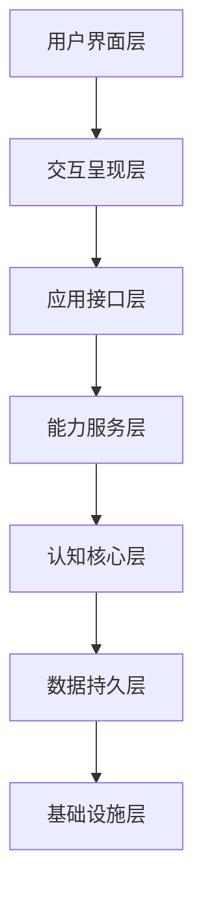

# 架构总览（Developer Guide）

版本：v2.0
最后更新：2026-03-16

## 1. 七层全栈架构

Mirexs 采用七层架构设计，从底层基础设施到上层交互呈现，确保功能模块解耦与扩展性。

## 2. 各层职责

- 基础设施层（infrastructure）
  - 资源管理、计算与存储
  - 消息总线、服务网格
  - 硬件检测与平台适配

- 数据持久层（data）
  - 向量数据库、图数据库、时序数据库
  - 模型与用户数据持久化

- 认知核心层（cognitive）
  - 任务分解、推理与规划
  - 学习与个性化
  - 多智能体协作

- 能力服务层（capabilities）
  - 创意生成、软件控制、系统管理
  - 工具编排与集成

- 应用接口层（application）
  - REST API、WebSocket
  - 插件系统、设备连接器

- 交互呈现层（interaction）
  - 多模态输入/输出
  - 3D 虚拟形象

- 用户界面层（UI）
  - 桌面、移动端、Web

## 3. 依赖约束

- 上层只能依赖下层
- 认知层不直接依赖 UI
- 安全治理层可跨层注入

## 4. 关键数据流

### 4.1 输入到响应

1. 输入系统（语音/视觉/文本）
2. 意图识别与任务分解
3. 路由决策与模型推理
4. 结果生成与输出

### 4.2 记忆更新

1. 对话记录
2. 实体关系抽取
3. 写入向量库与图数据库
4. 记忆巩固与遗忘

## 5. 配置与扩展

- 所有模块支持配置注入
- 插件可扩展能力与 API

---

本文件为契约优先文档，提供开发视角的架构说明。
