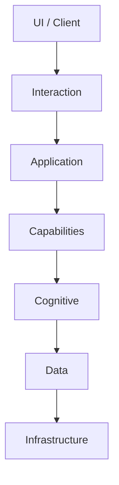

# 开发视角架构总览

## 1. 文档目标

本文件面向开发者，解释 Mirexs 代码仓库的分层方式、模块职责和开发时必须遵守的依赖边界。阅读顺序建议先看本文件，再进入各子架构文档。

## 2. 七层结构

## 3. 各层职责与常见目录

### 3.1 Infrastructure

目录：`infrastructure/`

职责：

- 硬件检测、模型管理、资源调度、缓存、分布式存储
- 平台适配、消息总线、网络管理和数据处理基础能力
- 为上层提供稳定的运行时基础设施

### 3.2 Data

目录：`data/`

职责：

- 管理模型文件、向量库、图数据库、时序数据和用户数据
- 统一数据读写入口和持久化目录结构

### 3.3 Cognitive

目录：`cognitive/`

职责：

- 实现推理、学习、记忆、情绪理解、强化学习等智能能力
- 不直接依赖 UI 表现细节

### 3.4 Capabilities

目录：`capabilities/`

职责：

- 将认知层决策落地成工具调用、知识访问、系统控制或创意生成
- 是“会想”与“会做”的连接层

### 3.5 Application

目录：`application/`

职责：

- 对外 API、网关、设备连接器、插件入口
- 负责把内部能力转换为可调用的系统接口

### 3.6 Interaction

目录：`interaction/`

职责：

- 处理语音、文本、视觉输入与输出
- 管理 3D 形象、反馈动画、口型同步等人机交互表现

### 3.7 UI / Client

目录：当前仓库以接口和交互能力为主，完整客户端形态仍在逐步补齐。

职责：

- 承载桌面、移动端或 Web 的最终用户界面

## 4. 开发时必须遵守的边界

- 上层可以依赖下层，下层不能反向依赖上层
- 认知层不能直接操作具体 UI 控件或界面状态
- 交互层不负责业务规则，只负责表现与输入输出
- 配置读取应集中在配置层或初始化流程中，不能散落在任意业务逻辑里
- 跨层数据结构必须稳定，不能依赖随意拼接的字典字段

## 5. 两条核心数据流

### 5.1 用户请求链路

1. `interaction/` 接收文本、语音或图像输入
2. `application/` 进行入口校验、鉴权和路由
3. `cognitive/` 解析意图、调用模型、生成决策
4. `capabilities/` 执行工具或知识检索
5. `interaction/` 负责输出文本、语音、动画或 3D 行为

### 5.2 记忆与知识链路

1. 对话与事件进入结构化抽取
2. 向量库保存语义表示
3. 图数据库维护实体与关系
4. 认知层在后续推理中联合检索和使用

## 6. 开发者进入任一模块前要先确认

- 该模块属于哪一层
- 它的输入输出由谁定义
- 它依赖哪些配置和外部服务
- 它的异常由哪一层收敛
- 需要同步更新哪些文档

## 7. 完成定义

一个模块开发完成，至少要满足：

- 代码职责清晰
- 路径与文档一致
- 有最小测试或最小验证方式
- 配置项、错误模型和依赖关系可说明
- 架构边界没有被破坏
