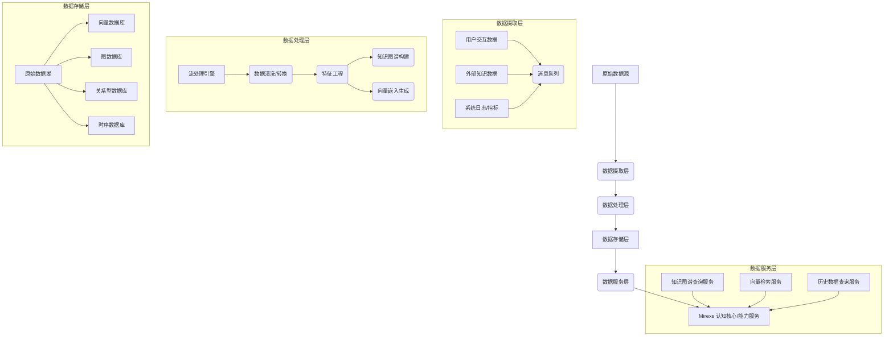

# 数据管道设计

## 0. 实现对齐摘要（2026-03-26）

本文档为数据管道的技术设计，当前状态为 **partial**。为避免“目标架构描述”与“仓库当前实现”混淆，特此说明当前真实代码状态：
- **数据存储/访问模块（已存在）**：`data/user_data/`、`data/databases/relational/`、`data/databases/vector_db/`、`data/databases/graph_db/`、`data/databases/time_series/`。
- **实时知识摄取（骨架占位）**：`capabilities/knowledge/`（如 `capabilities/knowledge/real_time_knowledge.py` 当前为占位）。
- **流式管道基础设施（目标项）**：Kafka/Flink/Spark Streaming 等在仓库中未作为可直接运行依赖交付；本文件第 3~6 节描述的是“目标数据管道”形态，落地时需补齐调度、队列、质量校验与端到端一致性测试。

## 1. 引言

Mirexs 作为情感化数字生命体，需要处理和整合海量的多模态数据，包括用户交互、外部知识、系统日志等。高效、稳定、可扩展的数据管道是 Mirexs 持续学习、记忆和认知能力的基础。本文档详细阐述 Mirexs 数据管道的技术设计，涵盖从原始数据摄取、清洗、转换，到特征工程、知识图谱构建、向量嵌入生成，以及数据同步与一致性保障的完整链路。

## 2. 设计目标与原则

### 2.1 设计目标

*   **实时性**：支持实时数据流处理，确保知识和记忆的及时更新。
*   **准确性**：保证数据在传输和处理过程中的完整性和正确性。
*   **可扩展性**：能够处理不断增长的数据量和多样化的数据源。
*   **鲁棒性**：具备容错机制，能够从故障中恢复，保证数据不丢失。
*   **安全性**：在整个数据生命周期中保护用户隐私和数据安全。
*   **可观测性**：提供全面的监控和日志，便于问题诊断和性能优化。

### 2.2 设计原则

*   **分层架构**：将数据管道划分为清晰的逻辑层，各层职责单一，降低耦合度。
*   **事件驱动**：采用消息队列作为核心通信机制，实现异步处理和解耦。
*   **Schema-on-Read**：尽可能延迟数据模式的强制定义，提高灵活性。
*   **数据治理**：建立数据质量、血缘和生命周期管理机制。
*   **成本效益**：平衡性能、存储和计算成本。

## 3. 数据管道整体架构

Mirexs 数据管道采用分层架构，主要包括数据摄取层、数据处理层、数据存储层和数据服务层。

## 4. 各层设计详解

### 4.1 数据摄取层 (Data Ingestion Layer)

**职责**：从各种异构数据源收集原始数据，并将其可靠地传输到数据处理层。

*   **核心组件**：
    *   **消息队列 (Message Queue)**：采用 Apache Kafka 或 RabbitMQ 作为核心消息总线，实现高吞吐量、低延迟的数据传输和解耦。所有原始数据都以事件的形式发布到不同的 Topic。
    *   **数据采集器 (Data Collectors)**：
        *   **用户交互采集**：监听用户与 Mirexs 的所有交互（文本、语音、视觉），实时生成事件并发送至消息队列。
        *   **外部知识采集**：通过 `capabilities/knowledge/`（当前为占位骨架）定期或实时抓取 RSS Feeds、新闻 API、学术论文等外部信息源；具体安全边界与证据链要求见相关文档。
        *   **系统日志/指标采集**：通过 Fluentd/Logstash 等工具收集系统运行日志、性能指标，并发送至消息队列。
*   **数据格式**：原始数据通常以 JSON 或 Avro 格式封装，包含时间戳、数据源、事件类型等元数据。

### 4.2 数据处理层 (Data Processing Layer)

**职责**：对摄取的数据进行清洗、转换、富化，并执行特征工程、知识图谱构建和向量嵌入生成等核心处理逻辑。

*   **核心组件**：
    *   **流处理引擎 (Stream Processing Engine)**：采用 Apache Flink 或 Spark Streaming 进行实时数据处理。对于批处理任务，可使用 Apache Spark。
    *   **数据清洗与转换**：
        *   **去重与标准化**：移除重复数据，统一数据格式和编码。
        *   **异常检测与过滤**：识别并处理无效、缺失或异常数据。
        *   **结构化转换**：将非结构化或半结构化数据转换为结构化格式。
    *   **特征工程 (Feature Engineering)**：
        *   **文本特征**：TF-IDF、词袋模型、预训练语言模型（如 BERT）的输出特征。
        *   **语音特征**：MFCC、声学特征。
        *   **视觉特征**：CNN 提取的图像特征。
        *   **行为特征**：用户交互频率、时长、偏好等。
    *   **知识图谱构建**：
        *   **实体抽取 (NER)**：从文本中识别并提取人名、地名、组织、概念等实体。
        *   **关系抽取 (RE)**：识别实体之间的语义关系。
        *   **事件抽取 (EE)**：识别并结构化描述事件。
        *   **消歧与融合**：解决实体指代模糊和实体合并问题，将新信息整合到 `data/databases/graph_db/` 中。
    *   **向量嵌入生成 (Vector Embedding Generation)**：
        *   **文本嵌入**：使用 `bge-small-zh-v1.5` 等模型将文本内容转换为高维向量。
        *   **多模态嵌入**：未来将集成视觉和语音嵌入模型，实现多模态信息的统一向量表示。
        *   **更新策略**：增量更新和定期全量更新相结合，确保向量数据库中的嵌入是最新的。

### 4.3 数据存储层 (Data Storage Layer)

**职责**：根据数据类型和访问模式，选择合适的存储系统进行持久化。

*   **核心组件**：
    *   **原始数据湖 (Data Lake)**：使用 HDFS 或 S3 存储所有原始、半结构化和结构化数据，作为数据溯源和离线分析的基础。
    *   **向量数据库 (Vector Database)**：`data/databases/vector_db/` 存储所有实体、文档块、用户偏好等的向量嵌入，支持高效的相似度搜索（实现包含 Chroma/FAISS 适配）。
    *   **图数据库 (Graph Database)**：`data/databases/graph_db/` 存储 Mirexs 的知识图谱，包括实体、关系及其属性（实现包含 Neo4j 适配）。
    *   **关系型数据库 (Relational Database)**：`data/databases/relational/` 存储用户配置、系统元数据、任务状态等结构化数据（实现包含 PostgreSQL/SQLite 适配）。
    *   **时序数据库 (Time-Series Database)**：`data/databases/time_series/` 存储系统日志、性能指标等时间序列数据（实现包含 InfluxDB 适配）。

### 4.4 数据服务层 (Data Service Layer)

**职责**：为 Mirexs 的认知核心和能力服务提供统一、高效的数据访问接口。

*   **核心组件**：
    *   **知识图谱查询服务**：提供基于 Cypher 或 GraphQL 的知识图谱查询接口，支持复杂关系推理。
    *   **向量检索服务**：提供语义相似度搜索、最近邻查询等接口，支持 RAG 架构。
    *   **历史数据查询服务**：提供用户交互历史、系统日志等数据的查询接口，支持个性化和问题诊断。
    *   **API 网关**：统一对外暴露数据服务接口，进行认证、授权和流量控制。

## 5. 数据同步与一致性保障

*   **增量同步**：对于实时性要求高的数据（如用户交互、外部知识），采用流处理方式进行增量同步，确保数据新鲜度。
*   **定期全量同步**：对于知识图谱和向量数据库，定期进行全量或部分全量同步，以修复潜在的数据不一致，并更新重要性评分。
*   **事务机制**：在关键数据操作中引入事务，确保数据操作的原子性、一致性、隔离性和持久性（ACID）。
*   **数据校验**：在数据进入不同处理阶段时，进行严格的数据格式和内容校验。

## 6. 性能指标与优化

*   **数据摄取吞吐量**：目标 ≥ 10,000 条/秒。
*   **端到端延迟**：从原始数据产生到知识图谱/向量数据库更新完成，P95 ≤ 5 秒。
*   **查询延迟**：知识图谱查询 P95 ≤ 80ms，向量检索 P95 ≤ 50ms。
*   **存储成本**：通过数据压缩、冷热数据分离等策略优化存储成本。

## 7. 参考文献

*   [1] Karau, H., Konwinski, A., Wendell, P., & Zaharia, M. (2015). *Learning Spark: Lightning-Fast Big Data Analysis*. O'Reilly Media.
*   [2] Confluent. (n.d.). *Apache Kafka*. Retrieved from [https://kafka.apache.org/](https://kafka.apache.org/)
*   [3] Neo4j. (n.d.). *Graph Database Platform*. Retrieved from [https://neo4j.com/](https://neo4j.com/)
*   [4] Li, Z., et al. (2026). *Mirexs项目设计.md*. Internal Document.

**作者签名**：Zikang Li
**日期**：2026-03-26
